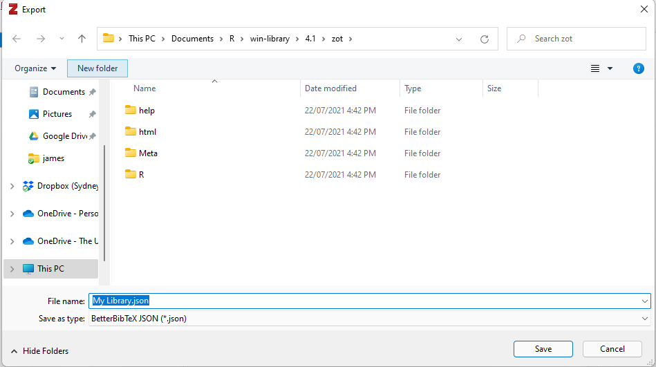
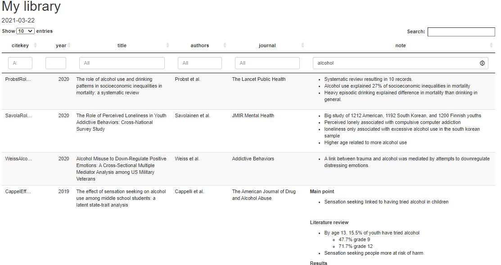

# Overview

zot formats your Zotero library into a searchable table. Zot builds upon
BetterBibTex which ensures that your notes and references are always up
to date.

# Installation

## R package

``` r
remotes::install_github("conig/zot")
```

## Better BibTex

This package requires [Zotero](https://www.zotero.org/) and [Better
BibTex](https://retorque.re/zotero-better-bibtex/installation/) to be
installed.

# Getting things running

To use this package, an automatic export from Zotero needs to be set up.

**1. Right click library, and click “Export Library”**


**2. Set format to BetterBibTex debug JSON, select ‘Export Notes’, and
‘Keep updated’**


**3. Save the JSON to zot’s directory (wherever R installed it)**



# Usage

Calling the `note()` function will create an html document containing a
searchable datatable. All html formatting from zotero notes will be
rendered.

``` r
zot::note()
```


